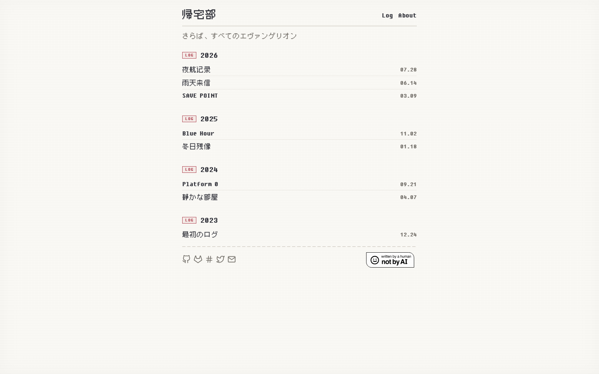
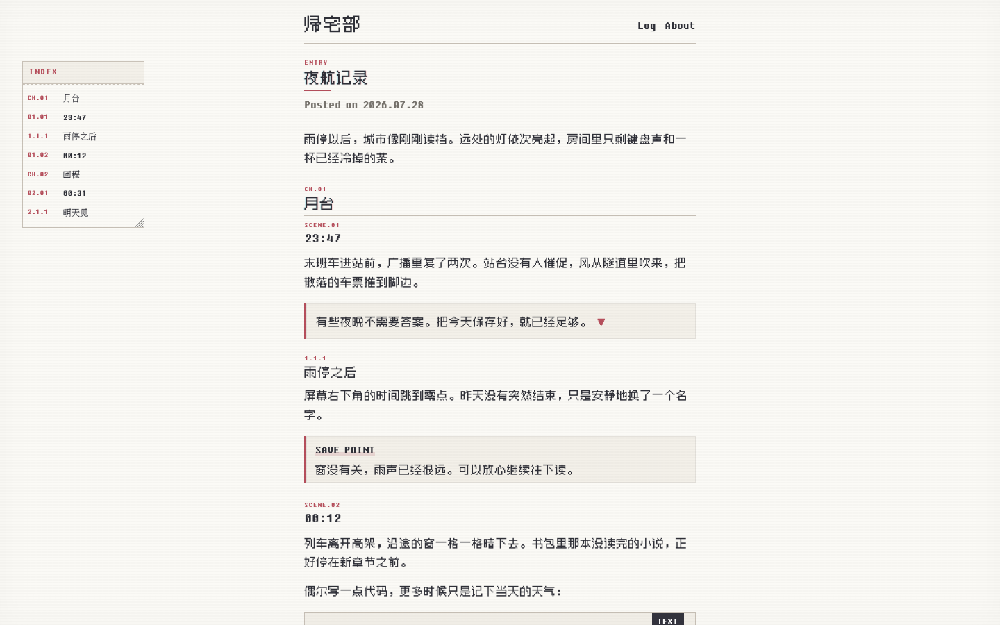
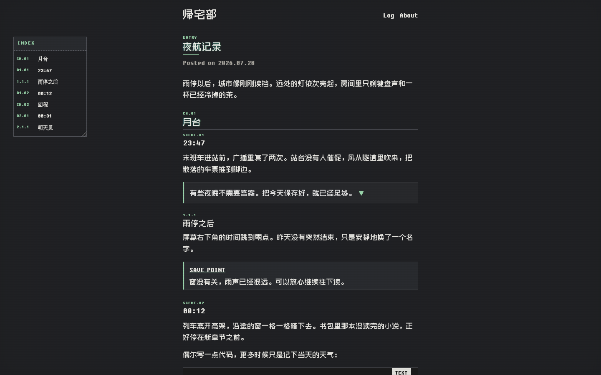
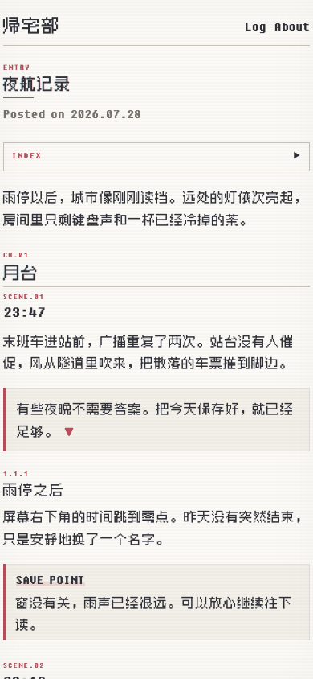

# Pixel

[简体中文](README.zh-CN.md) · [Live site](https://ao2233.github.io)

A Hugo theme for long notes and small archives. Its visual language comes from old screens and light novels: bitmap type, numbered chapters, thin rules, and a restrained red accent. The page still reads like a page.



## Reading first

The article column is held to a comfortable measure. `CH` and `SCENE` numbers follow the document structure and restart inside each chapter. On wide screens, the index can be moved and resized like a note; when space runs out, it folds back into the article.



<table>
  <tr>
    <td width="68%"></td>
    <td width="32%"></td>
  </tr>
  <tr>
    <td align="center">Dark</td>
    <td align="center">Mobile</td>
  </tr>
</table>

## Included

- Automatic light and dark modes, with a full-width mobile layout
- CJK-first pixel typography, syntax highlighting, KaTeX, and Mermaid
- Movable and resizable table of contents with an inline fallback
- Image zoom, callouts, collapsible boxes, and media shortcodes

Parameters and copy-ready examples for every content component are collected in the [shortcode reference](SHORTCODES.md).

## Use

Add the theme:

```sh
git submodule add https://github.com/AO2233/pixel.git themes/pixel
```

Then select it in your Hugo configuration:

```yaml
theme: pixel
```

The included [`hugo.yaml`](hugo.yaml) is a working reference for Goldmark, code highlighting, the table of contents, menus, and theme parameters.

### Social icons

Footer icons are inlined from `assets/icons/social/` at build time. Choose a
filename from the bundled [icon catalog](assets/icons/CATALOG.md) and use it as
the `icon` value in `params.social`. Icons inherit the footer color in both
light and dark mode. Add another SVG to the same directory to extend the set
without adding client-side JavaScript.

## License and credits

Pixel's original theme code is released under the [MIT License](LICENSE). The theme fonts in `static/fonts/` are not covered by that license, and this repository grants no public license for them. Read the [font notice](FONT_NOTICE.md) before publishing or redistributing the theme.

The JavaScript libraries used by the theme retain their own licenses. Their versions, upstream projects, and acknowledgements are listed in [Third-party notices](THIRD_PARTY_NOTICES.md).
