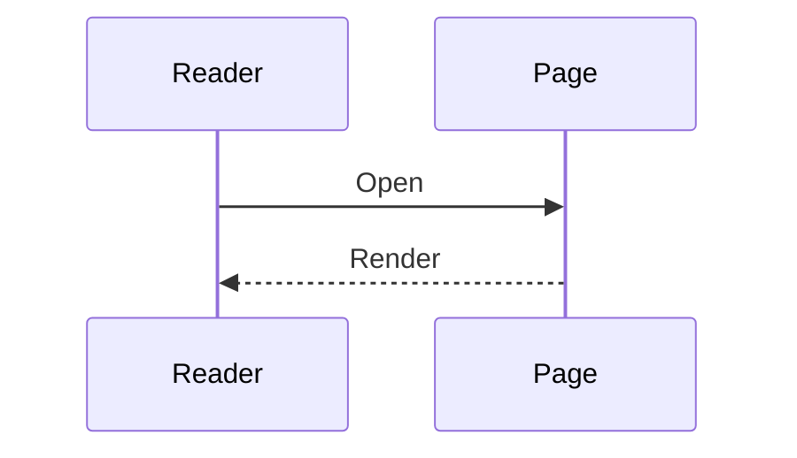

# Pixel shortcode reference

[简体中文](SHORTCODES.zh-CN.md) · [Back to Pixel](README.md)

Pixel includes twelve custom shortcodes. The examples below use named parameters unless a positional form is explicitly shown.

Put local media in your site's `static` directory. A file stored at `static/media/example.webp` is available as `/media/example.webp`.

## Index

| Shortcode | Purpose |
| --- | --- |
| [`aplayer`](#aplayer) | Audio player with cover and lyrics |
| [`bilibili`](#bilibili) | Responsive Bilibili embed |
| [`box`](#box) | Collapsible content |
| [`callout`](#callout) | Visual-novel-style message box |
| [`date`](#date) | Client-side pixel date display |
| [`dplayer`](#dplayer) | Video player powered by DPlayer |
| [`img`](#img) | Zoomable image or gallery |
| [`mermaid`](#mermaid) | Scrollable Mermaid diagram |
| [`moe`](#moe) | Hover-to-reveal text mask |
| [`pdf`](#pdf) | Embedded PDF document |
| [`spotify`](#spotify) | Spotify widget |
| [`video`](#video) | Muted, looping HTML video |

## `aplayer`

Renders a single-track APlayer. Its CSS and JavaScript are loaded only on pages that use this shortcode.

```go-html-template

```

| Parameter | Required | Default | Description |
| --- | --- | --- | --- |
| `url` | yes | — | Audio URL. Local paths are processed with Hugo's `relURL`. |
| `name` | no | `Audio` | Track title. |
| `artist` | no | empty | Artist name. |
| `cover` | no | empty | Cover URL. Local paths are processed with `relURL`. |
| `lrc` | no | empty | Value passed to APlayer as the track's LRC source. |
| `fix` | no | `false` | Set to `"true"` for APlayer's fixed mode. |
| `auto` | no | `false` | Set to `"true"` to request autoplay. |
| `id` | no | generated | HTML container ID. Set this only when another script needs a stable ID. |

Browsers can block autoplay even when `auto="true"`. Every player on a page needs a unique `id`; generated IDs already satisfy this.

## `bilibili`

Embeds the first page of a Bilibili video in a responsive 16:9 frame.

```go-html-template

```

The BVID can also be positional:

```go-html-template

```

| Parameter | Required | Default | Description |
| --- | --- | --- | --- |
| `bvid` | yes | positional parameter `0` | Bilibili video ID. |

The embed enables danmaku and high-quality mode, keeps autoplay off, and always requests `page=1`. Loading the player sends a request to Bilibili.

## `box`

Creates a native `<details>` block. It starts closed and accepts Markdown in both its title and body.

```go-html-template

This paragraph is hidden until the reader opens the box.

- Markdown
- remains available

```

| Parameter | Required | Default | Description |
| --- | --- | --- | --- |
| `title` | no | `Details` | Text shown in the summary bar. Markdown is allowed. |

There is no `open` parameter. Add it to the template itself if boxes should start expanded.

## `callout`

Creates the theme's bordered message panel. The body accepts Markdown.

```go-html-template

Some nights do not need an answer. Save today and keep going.

```

This shortcode has no parameters. For labeled variants, use the [fenced callouts](#fenced-callouts) described later in this document.

## `date`

Displays the reader's current local date as eight pixel digits in `YYYYMMDD` order.

```go-html-template

```

This shortcode has no parameters. It runs in the browser, so the result is the reader's date rather than the Hugo build date. Digit images are loaded from:

```text
/counter/gelbooru/0.gif
…
/counter/gelbooru/9.gif
```

The files are included with the theme. Because the paths begin at the domain root, a site deployed below a subpath may need to adjust `layouts/shortcodes/date.html`.

## `dplayer`

Renders a DPlayer instance for a direct video stream or file. DPlayer assets are loaded only on pages that use this shortcode.

```go-html-template

```

| Parameter | Required | Default | Description |
| --- | --- | --- | --- |
| `url` | yes | — | Direct video or stream URL passed to DPlayer. |
| `id` | no | generated | HTML container ID. |

Screenshot capture, AirPlay, Chromecast, and automatic preloading are enabled. For a plain native player with controls, use Markdown video embedding as described under [media render hooks](#media-render-hooks).

## `img`

Renders one or more zoomable images with a shared caption. Multiple sources are separated by commas.

```go-html-template

```

Gallery:

```go-html-template

```

| Parameter | Required | Default | Description |
| --- | --- | --- | --- |
| `src` | yes | — | One image URL or a comma-separated list. |
| `alt` | no | plain-text `caption` | Alternative text used for every image. |
| `caption` | no | empty | Shared caption. Markdown is allowed. |
| `layout` | no | `wide` | `text`, `wide`, or `full`. |
| `width` | no | `700px` | Maximum width of each gallery item. Any valid CSS length is accepted. |

Layout behavior:

- `text` stays inside the article column.
- `wide` can expand to `62rem`.
- `full` can expand to `74rem` and forces the floating table of contents back into the article so the media has a clear canvas.

Image zoom is initialized automatically. Use meaningful `alt` text; when a gallery contains different subjects, separate it into multiple shortcode calls so each image can have the correct description.

## `mermaid`

Renders a Mermaid diagram inside a horizontally scrollable container.

```go-html-template

flowchart LR
    Draft --> Build
    Build --> Publish

```

This shortcode has no parameters. Mermaid is loaded only on pages containing this shortcode or a fenced `mermaid` block. The diagram follows the system color scheme; changing the scheme while the page is open reloads the page.

## `moe`

Masks inline text until it is hovered.

```go-html-template
The access code is 23:47.
```

This shortcode has no parameters. Keep the inner content short and inline. The current reveal interaction is hover-based, so it should not be the only way to expose essential information on touch or keyboard-only devices.

## `pdf`

Embeds a PDF with PDFObject.

```go-html-template

```

| Parameter | Required | Default | Description |
| --- | --- | --- | --- |
| `src` | yes | — | PDF URL passed to PDFObject. |
| `id` | no | generated | HTML container ID. |

The viewer height is fixed at `70em`. If the browser cannot embed PDFs, PDFObject renders a link to the document. Browser PDF support varies, particularly inside mobile WebViews.

## `spotify`

Embeds a Spotify artist, album, playlist, track, show, or episode. This shortcode requires Hugo `0.114.0` or later.

```go-html-template

```

A track ID can be used directly:

```go-html-template


```

| Parameter | Required | Default | Description |
| --- | --- | --- | --- |
| `url` | one source required | — | Full Spotify content URL. |
| `track` | one source required | — | Track ID or URL; fallback for `url`. |
| positional `0` | one source required | — | Track ID or URL; fallback for `url` and `track`. |
| `id` | no | generated | iframe ID. |
| `class` | no | generated | Additional iframe class. |
| `width` | no | `100%` | CSS width. |
| `height` | no | type-dependent | CSS height. |
| `loading` | no | `lazy` | iframe loading mode. |
| `useTheme` | no | `true` | Set to `"false"` to request Spotify's dark gray background. |

Default heights are `380px` for artists, albums, and playlists; `232px` for episodes; and `152px` for shows and tracks. Loading the widget sends a request to Spotify and is subject to Spotify's own terms and privacy policy.

## `video`

Renders a native video intended for short, silent loops.

```go-html-template

```

| Parameter | Required | Default | Description |
| --- | --- | --- | --- |
| `src` | yes | — | Video URL. |
| `type` | no | `video/mp4` | Source MIME type. |
| `width` | no | `100%` | Maximum player width. Any valid CSS length is accepted. |
| `caption` | no | empty | Caption below the video. Markdown is allowed. |

The video is `autoplay`, `loop`, `muted`, `playsinline`, and has no controls. Use the Markdown video form below when the reader needs playback controls.

## Related content features

These are not custom shortcodes, but they use the same theme styles and conditional asset loading.

### Fenced callouts

The code block types `note`, `tip`, `warning`, and `caution` become labeled callouts:

````markdown
```warning
This operation cannot be undone.
```
````

### Mermaid fences

A Mermaid code fence is equivalent to the `mermaid` shortcode:

````markdown

````

### Media render hooks

Normal Markdown images are wide, captioned by their optional title, and zoomable:

```markdown

```

An image destination ending in `.mp4`, `.webm`, or `.ogg` becomes a native video with controls:

```markdown

```

### Math

KaTeX supports display and inline delimiters:

```markdown
$$ E = mc^2 $$

\( a^2 + b^2 = c^2 \)
```

Prefer `\(...\)` for inline math. Pages containing only single-dollar inline expressions may not trigger the conditional KaTeX loader.

### Hugo built-ins

Hugo's built-in YouTube shortcode is styled as wide responsive media:

```go-html-template

```

Third-party embeds contact their respective services. Review their privacy requirements before using them on a public site.
