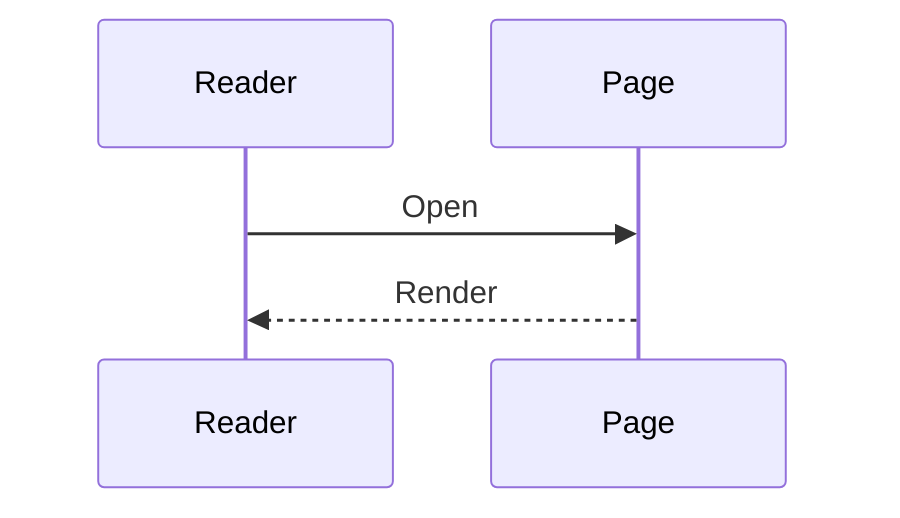

# Pixel Shortcode 参考

[English](SHORTCODES.md) · [返回 Pixel](README.zh-CN.md)

Pixel 内置 12 个自定义 shortcode。除非特别写出位置参数，下面的示例均使用命名参数。

本地媒体建议放在站点的 `static` 目录。例如 `static/media/example.webp` 对应页面地址 `/media/example.webp`。

## 索引

| Shortcode | 用途 |
| --- | --- |
| [`aplayer`](#aplayer) | 带封面与歌词的音频播放器 |
| [`bilibili`](#bilibili) | 响应式 Bilibili 播放器 |
| [`box`](#box) | 折叠内容 |
| [`callout`](#callout) | 视觉小说式消息框 |
| [`date`](#date) | 浏览器端像素日期 |
| [`dplayer`](#dplayer) | DPlayer 视频播放器 |
| [`img`](#img) | 可缩放图片或画廊 |
| [`mermaid`](#mermaid) | 可横向滚动的 Mermaid 图表 |
| [`moe`](#moe) | 悬停显示的文字遮罩 |
| [`pdf`](#pdf) | 嵌入 PDF 文档 |
| [`spotify`](#spotify) | Spotify 小组件 |
| [`video`](#video) | 静音循环 HTML 视频 |

## `aplayer`

渲染单曲 APlayer。只有使用该 shortcode 的页面才会加载 APlayer 的 CSS 和 JavaScript。

```go-html-template

```

| 参数 | 必需 | 默认值 | 说明 |
| --- | --- | --- | --- |
| `url` | 是 | — | 音频地址。本地路径会经过 Hugo `relURL` 处理。 |
| `name` | 否 | `Audio` | 曲名。 |
| `artist` | 否 | 空 | 艺术家名称。 |
| `cover` | 否 | 空 | 封面地址。本地路径会经过 `relURL` 处理。 |
| `lrc` | 否 | 空 | 原样传给 APlayer 的 LRC 来源。 |
| `fix` | 否 | `false` | 设为 `"true"` 启用 APlayer 固定模式。 |
| `auto` | 否 | `false` | 设为 `"true"` 请求自动播放。 |
| `id` | 否 | 自动生成 | 播放器容器 ID。只有其他脚本需要固定 ID 时才需要填写。 |

即使设置 `auto="true"`，浏览器仍可能拦截自动播放。同一页面的每个播放器都需要不同的 `id`；自动生成的 ID 已经满足这一点。

## `bilibili`

以 16:9 响应式框架嵌入 Bilibili 视频的第一页。

```go-html-template

```

BVID 也可以写成位置参数：

```go-html-template

```

| 参数 | 必需 | 默认值 | 说明 |
| --- | --- | --- | --- |
| `bvid` | 是 | 位置参数 `0` | Bilibili 视频 ID。 |

播放器开启弹幕和高画质，关闭自动播放，并固定请求 `page=1`。加载播放器会向 Bilibili 发起网络请求。

## `box`

生成原生 `<details>` 折叠框。默认收起，标题和正文都可以使用 Markdown。

```go-html-template

这一段会在读者展开折叠框后显示。

- Markdown
- 可以正常使用

```

| 参数 | 必需 | 默认值 | 说明 |
| --- | --- | --- | --- |
| `title` | 否 | `Details` | 摘要栏文字，可以使用 Markdown。 |

目前没有 `open` 参数。如需默认展开，需要直接修改 shortcode 模板。

## `callout`

生成主题内置的边框消息面板，正文可以使用 Markdown。

```go-html-template

有些夜晚不需要答案。保存今天，然后继续。

```

该 shortcode 没有参数。需要带类型标签的提示框时，可以使用后文的[围栏提示框](#围栏提示框)。

## `date`

按照 `YYYYMMDD` 顺序，以八个像素数字显示读者当地的当前日期。

```go-html-template

```

该 shortcode 没有参数。日期由浏览器计算，因此显示的是读者日期，不是 Hugo 构建日期。数字图片从以下路径读取：

```text
/counter/gelbooru/0.gif
…
/counter/gelbooru/9.gif
```

主题已经包含这些文件。由于路径从域名根目录开始，部署在子路径下的站点可能需要调整 `layouts/shortcodes/date.html`。

## `dplayer`

为视频文件或直播流生成 DPlayer。只有使用该 shortcode 的页面才会加载 DPlayer 脚本。

```go-html-template

```

| 参数 | 必需 | 默认值 | 说明 |
| --- | --- | --- | --- |
| `url` | 是 | — | 直接传给 DPlayer 的视频或流地址。 |
| `id` | 否 | 自动生成 | 播放器容器 ID。 |

截图、AirPlay、Chromecast 和自动预加载均已开启。如果只需要带控制栏的原生播放器，可以使用[媒体渲染钩子](#媒体渲染钩子)中的 Markdown 视频写法。

## `img`

渲染一张或多张可缩放图片，并使用同一个说明文字。多张图片的地址以英文逗号分隔。

```go-html-template

```

画廊：

```go-html-template

```

| 参数 | 必需 | 默认值 | 说明 |
| --- | --- | --- | --- |
| `src` | 是 | — | 单张图片地址，或以逗号分隔的地址列表。 |
| `alt` | 否 | `caption` 的纯文本 | 每张图片共用的替代文字。 |
| `caption` | 否 | 空 | 共用说明文字，可以使用 Markdown。 |
| `layout` | 否 | `wide` | 可选 `text`、`wide` 或 `full`。 |
| `width` | 否 | `700px` | 每个画廊项目的最大宽度，接受合法 CSS 长度。 |

三种布局：

- `text` 保持在正文栏内。
- `wide` 最宽可扩展到 `62rem`。
- `full` 最宽可扩展到 `74rem`，同时会让浮动目录回到正文内，为图片留出完整空间。

图片缩放会自动初始化。请认真填写 `alt`；如果画廊里的图片内容不同，最好拆成多次调用，让每张图片获得准确说明。

## `mermaid`

在可以横向滚动的容器中渲染 Mermaid 图表。

```go-html-template

flowchart LR
    Draft --> Build
    Build --> Publish

```

该 shortcode 没有参数。只有出现此 shortcode 或 `mermaid` 围栏代码块时才会加载 Mermaid。图表会跟随系统配色；页面打开期间切换系统主题会重新载入页面。

## `moe`

遮住行内文字，鼠标悬停后显示。

```go-html-template
访问代码是 23:47。
```

该 shortcode 没有参数。内部内容应当保持简短并位于行内。目前的显示交互依赖悬停，因此不要用它隐藏触屏或仅使用键盘的读者必须看到的信息。

## `pdf`

使用 PDFObject 嵌入 PDF。

```go-html-template

```

| 参数 | 必需 | 默认值 | 说明 |
| --- | --- | --- | --- |
| `src` | 是 | — | 传给 PDFObject 的 PDF 地址。 |
| `id` | 否 | 自动生成 | 容器 ID。 |

阅读器高度固定为 `70em`。浏览器无法嵌入 PDF 时，PDFObject 会显示文档链接。不同浏览器的 PDF 支持并不一致，移动端 WebView 尤其如此。

## `spotify`

嵌入 Spotify 艺术家、专辑、播放列表、单曲、节目或单集。该 shortcode 要求 Hugo `0.114.0` 或更高版本。

```go-html-template

```

也可以直接使用单曲 ID：

```go-html-template


```

| 参数 | 必需 | 默认值 | 说明 |
| --- | --- | --- | --- |
| `url` | 三种来源选一 | — | 完整 Spotify 内容地址。 |
| `track` | 三种来源选一 | — | 单曲 ID 或地址，作为 `url` 的后备。 |
| 位置参数 `0` | 三种来源选一 | — | 单曲 ID 或地址，作为 `url`、`track` 的后备。 |
| `id` | 否 | 自动生成 | iframe ID。 |
| `class` | 否 | 自动生成 | 额外的 iframe class。 |
| `width` | 否 | `100%` | CSS 宽度。 |
| `height` | 否 | 依内容类型决定 | CSS 高度。 |
| `loading` | 否 | `lazy` | iframe 加载模式。 |
| `useTheme` | 否 | `true` | 设为 `"false"` 请求 Spotify 深灰色背景。 |

艺术家、专辑和播放列表默认高 `380px`，单集为 `232px`，节目和单曲为 `152px`。加载组件会向 Spotify 发起请求，并受 Spotify 自身条款与隐私政策约束。

## `video`

生成适合短动画或背景画面的原生视频。

```go-html-template

```

| 参数 | 必需 | 默认值 | 说明 |
| --- | --- | --- | --- |
| `src` | 是 | — | 视频地址。 |
| `type` | 否 | `video/mp4` | 视频 MIME 类型。 |
| `width` | 否 | `100%` | 播放器最大宽度，接受合法 CSS 长度。 |
| `caption` | 否 | 空 | 视频下方的说明文字，可以使用 Markdown。 |

视频固定使用 `autoplay`、`loop`、`muted` 和 `playsinline`，没有控制栏。如果读者需要控制播放，请使用下面的 Markdown 视频写法。

## 相关内容功能

下面这些不是自定义 shortcode，但与主题样式和按需资源加载完整配合。

### 围栏提示框

类型为 `note`、`tip`、`warning` 或 `caution` 的代码围栏会变成带标签提示框：

````markdown
```warning
这个操作无法撤销。
```
````

### Mermaid 围栏

Mermaid 代码围栏与 `mermaid` shortcode 等效：

````markdown

````

### 媒体渲染钩子

普通 Markdown 图片默认使用宽版布局，以可选标题作为图片说明，并支持点击缩放：

```markdown

```

图片地址以 `.mp4`、`.webm` 或 `.ogg` 结尾时，会渲染为带控制栏的原生视频：

```markdown

```

### 数学公式

KaTeX 支持行间与行内定界符：

```markdown
$$ E = mc^2 $$

\( a^2 + b^2 = c^2 \)
```

行内公式建议使用 `\(...\)`。如果页面只有单美元符号形式的行内公式，可能不会触发 KaTeX 的按需加载。

### Hugo 内置功能

Hugo 自带的 YouTube shortcode 会使用主题的宽版响应式样式：

```go-html-template

```

第三方嵌入会联系对应服务。用于公开站点前，请自行确认隐私和合规要求。
